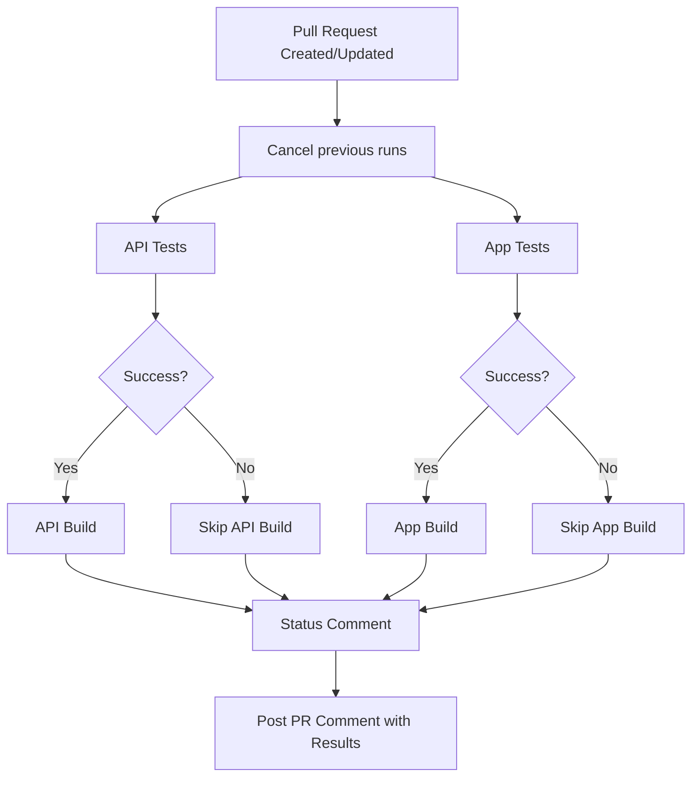

```mermaid
flowchart TD
    PR[Pull Request Created/Updated] --> Concurrent[Cancel previous runs]
    Concurrent --> AT[API Tests]
    Concurrent --> AppT[App Tests]
    
    AT --> AT_Result{Success?}
    AT_Result -->|Yes| AB[API Build]
    AT_Result -->|No| Skip_AB[Skip API Build]
    
    AppT --> AppT_Result{Success?}
    AppT_Result -->|Yes| AppB[App Build]
    AppT_Result -->|No| Skip_AppB[Skip App Build]
    
    AB --> SC[Status Comment]
    AppB --> SC
    Skip_AB --> SC
    Skip_AppB --> SC
    
    SC --> Comment[Post PR Comment with Results]
```